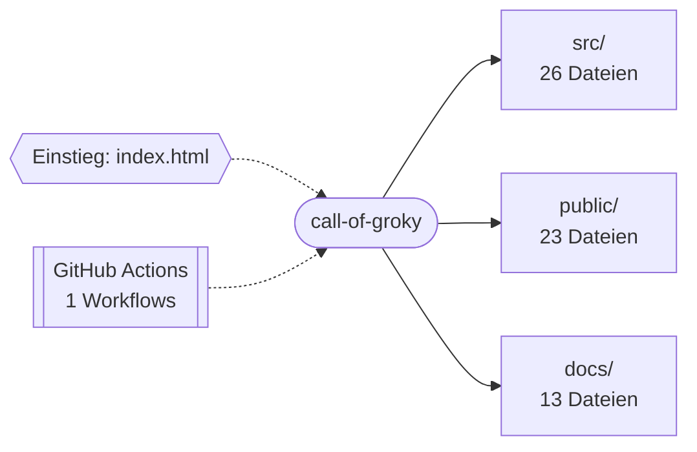

<div align="center">

# Call of Groky

<p><strong>Call of Groky: Three.js-FPS im Browser.</strong></p>
<p>


</p>
<p>
<a href="https://github.com/Pierreg99/call-of-groky/actions/workflows/deploy.yml"></a>
</p>
<p><a href="#schnellstart">Schnellstart</a> · <a href="#projektstruktur">Projektstruktur</a> · <a href="#english-summary">English</a></p>
</div>

---

## Inhaltsverzeichnis

- [Überblick](#überblick)
- [Features](#features)
- [Schnellstart](#schnellstart)
- [Architektur](#architektur)
- [Projektstruktur](#projektstruktur)
- [Dokumentation](#dokumentation)
- [Projektdetails](#projektdetails)
- [English summary](#english-summary)
- [Lizenzhinweis](#lizenzhinweis)

## Überblick

Call of Groky: Three.js-FPS im Browser.

| Merkmal | Wert |
| --- | --- |
| Sprachen | TypeScript (88%), CSS (10%), HTML (2%) |
| Dateien im Repository | 76 |
| Einstiegspunkte | `index.html`, `src/main.ts` |
| Version (`package.json`) | 0.1.1 |
| CI-Workflows | 1 |
| Lizenz | [LICENSE](LICENSE) |

## Features

- 3D-Rendering mit Three.js
- Entwicklungsserver und Build mit Vite
- Physik mit cannon-es
- Typprüfung mit TypeScript
- Canvas-2D-Rendering
- Klangerzeugung über die Web Audio API
- Lokale Speicherung im Browser (localStorage)
- Touch- und Pointer-Steuerung
- Echtzeit-Render-Schleife (requestAnimationFrame)
- Automatisierung über GitHub Actions: `deploy.yml`
- Veröffentlichung über GitHub Pages
- 1 3D-Modelle (GLB/glTF)
- 14 Markdown-Dokumente

## Schnellstart

```bash
git clone https://github.com/Pierreg99/call-of-groky.git
cd call-of-groky
```

**Node.js**

```bash
npm install
npm run dev
npm run build
npm run preview
```

<details>
<summary>Alle Skripte aus <code>package.json</code></summary>

| Skript | Befehl |
| --- | --- |
| `dev` | `vite` |
| `build` | `tsc && vite build` |
| `preview` | `vite preview` |

</details>

## Architektur

Übersicht der wichtigsten Verzeichnisse nach Anzahl der enthaltenen Dateien.



## Projektstruktur

```text
call-of-groky/
├── .github/  (1 Datei)
│   └── workflows/
├── docs/  (13 Dateien)
│   ├── credits/
│   ├── shots/
│   ├── COMPARE_BOTY.md
│   ├── gallery.md
│   ├── index.html
│   ├── LICENSES.md
│   └── … (3 weitere)
├── public/  (23 Dateien)
│   ├── hdri/
│   ├── models/
│   └── textures/
├── src/  (26 Dateien)
│   ├── audio/
│   ├── combat/
│   ├── enemies/
│   ├── engine/
│   ├── player/
│   ├── ui/
│   └── … (4 weitere)
├── .gitignore
├── CHANGELOG.md
├── CRITIC.md
├── IMPROVE_NOTES.md
├── index.html
├── LICENSE
├── package-lock.json
├── package.json
├── README.md
├── RELEASE.md
├── tsconfig.json
└── vite.config.ts
```

## Dokumentation

- [CHANGELOG.md](CHANGELOG.md)
- [CRITIC.md](CRITIC.md)
- [IMPROVE_NOTES.md](IMPROVE_NOTES.md)
- [RELEASE.md](RELEASE.md)
- [docs/COMPARE_BOTY.md](docs/COMPARE_BOTY.md)
- [docs/gallery.md](docs/gallery.md)
- [docs/LICENSES.md](docs/LICENSES.md)
- [docs/PLAN.md](docs/PLAN.md)
- [docs/PROGRESS.md](docs/PROGRESS.md)
- [docs/ROADMAP.md](docs/ROADMAP.md)

## Projektdetails

Der folgende Abschnitt übernimmt die bisherige Projektdokumentation.

Cinematic **Three.js** FPS greybox — Loop 8 settings, defend-tower objective, weapon inspect, scout archetype, desktop + touch controls.

Not a Call of Duty clone. Premium-feeling WebGL arena shooter (Vite + TypeScript + Three.js r170+). Browser Three.js pushed harder; still **not** an IW-engine peer.

**Ship:** Browser-AAA **GO** (User Accept, SwiftShader-only perf) · CoD visual parity **FAIL** — see [RELEASE.md](./RELEASE.md).

## Play

**GitHub Pages:** https://pierreg99.github.io/call-of-groky/

## Run locally

```bash
npm ci
npm run dev
```

Open the printed URL (Vite `base` is `/call-of-groky/`). Production:

```bash
npm run build
npm run preview
```

## Controls

| Input | Action |
|-------|--------|
| Click / Deploy | Pointer lock (desktop) |
| Tap Deploy | Start play (touch / coarse pointer — no PointerLock) |
| WASD | Move |
| Mouse | Look |
| Shift | Sprint |
| Ctrl | Crouch |
| Space | Jump |
| LMB | Fire |
| RMB | ADS (FOV lerp) |
| R | Reload |
| F | Inspect weapon (tap or long-press) |
| 1 / 2 | Switch rifle / SMG |
| Mouse wheel | Cycle weapons |
| Esc / gear | Settings (sensitivity + quality) |
| F3 / backtick | Toggle FPS counter |

### Mobile / touch

On touch / coarse-pointer devices an on-screen overlay appears after Deploy:

| Touch | Action |
|-------|--------|
| Left virtual stick | Move (WASD-equivalent) |
| Right-half drag | Look (yaw/pitch, no PointerLock) |
| FIRE (hold) | Fire |
| ADS (hold) | Aim down sights |
| JMP | Jump |
| RLD | Reload |
| SPR (hold) | Sprint |
| WPN | Switch weapon |
| INS | Inspect |

Buttons are ≥44px with safe-area insets. Desktop PointerLock path is unchanged.

## Objective

1. Eliminate **10** hostiles (waves at 5 and 10).
2. **Defend** the control tower zone for **30 seconds**.
3. **MISSION COMPLETE** win banner.

## Quality presets

Auto-detected from CPU cores / `deviceMemory`, overridable in Settings or `?quality=low|medium|high`. Canvas MSAA off; AA is post.

**User approve 2026-09-05:** Bloom / SSAO / Chromatic / SMAA on **all** presets. Low keeps ShadowMap **512** and pixelRatio cap **1**.

| Preset | Pixel ratio | Shadow map | Post AA | Bloom | SSAO | Chromatic |
|--------|-------------|------------|---------|-------|------|-----------|
| **low** | ≤1 | **512** | SMAA | on (subtle) | on | on |
| **medium** | ≤1.5 | 1536 | SMAA | on | on | on |
| **high** | ≤2 | 2048 | SMAA | on (punchier) | on | on |

Vignette scales with preset. `prefers-reduced-motion: reduce` dampens recoil/bob, chromatic, and CSS vignette.

## Loop 8 features

- **Settings panel:** look sensitivity + quality Low/Med/High (persisted)
- **Defend tower** hold after 10 kills → WIN
- **Weapon inspect** + switch polish
- **Scout** archetype (cyan / faster / fragile)
- Prior loops: minimap, waves, dual weapons, compass, tower, HDRI, killcam-lite, juice, touch overlay

## Stack

- Vite 5 + TypeScript
- Three.js ≥ 0.170 (PointerLockControls, EffectComposer, SMAA, UnrealBloom, SSAO, RGBELoader, GLTFLoader)

## Project layout

```
src/     engine player world combat enemies audio ui
public/  hdri models audio
docs/    shots credits ROADMAP PROGRESS PLAN gallery
```

## Documentation

| Doc | Contents |
|-----|----------|
| [RELEASE.md](./RELEASE.md) | Ship gates (GO / CoD FAIL / SwiftShader perf) |
| [CHANGELOG.md](./CHANGELOG.md) | Phase 1 → Loop 8 + Ship / PostFX / touch |
| [docs/ROADMAP.md](./docs/ROADMAP.md) | Near / mid / long; CoD-parity out of scope |
| [docs/PROGRESS.md](./docs/PROGRESS.md) | Loop and gate status table |
| [docs/PLAN.md](./docs/PLAN.md) | Architecture + optional next work |
| [docs/gallery.md](./docs/gallery.md) | Screenshot gallery |
| [CRITIC.md](./CRITIC.md) | Honest visual self-critique |
| [docs/credits/ATTRIBUTION.md](./docs/credits/ATTRIBUTION.md) | Third-party assets |
| [docs/LICENSES.md](./docs/LICENSES.md) | License summary |

## Screenshots

See [`docs/shots/`](./docs/shots/) and [`docs/gallery.md`](./docs/gallery.md).

## Honest gaps

See [`CRITIC.md`](./CRITIC.md). **Does not claim CoD visual parity.** Ship **GO** is Browser-AAA via User Accept (S5), not CoD PASS.

## Deutsch (kurz)

**Call of Groky** — cineastischer Three.js-FPS-Greybox (Vite + TypeScript). Spielen: https://pierreg99.github.io/call-of-groky/

Desktop: WASD / Maus / ADS / Nachladen / Einstellungen (Esc). Touch: virtueller Stick links, Look rechts, FIRE / ADS / JMP / RLD / SPR / WPN.

Ziel: 10 Gegner ausschalten, dann Kontrollturm **30 s** halten → MISSION COMPLETE.

Qualität: Low / Medium / High (Schatten 512 / 1536 / 2048); PostFX (Bloom, SSAO, Chromatik, SMAA) auf allen Presets freigeschaltet. **Ship GO** / **kein** CoD-Paritätsanspruch — Details in `RELEASE.md` und `CRITIC.md`.

## License

MIT — see [LICENSE](./LICENSE). Third-party CC0 assets and library notices: [docs/LICENSES.md](./docs/LICENSES.md), [docs/credits/ATTRIBUTION.md](./docs/credits/ATTRIBUTION.md).

## English summary

Call of Groky: Three.js FPS in the browser.

Clone the repository and follow the commands in [Schnellstart](#schnellstart); the [project layout](#projektstruktur) shows where the code lives. Further documents are listed under [Dokumentation](#dokumentation).

## Lizenzhinweis

Siehe [LICENSE](LICENSE).
