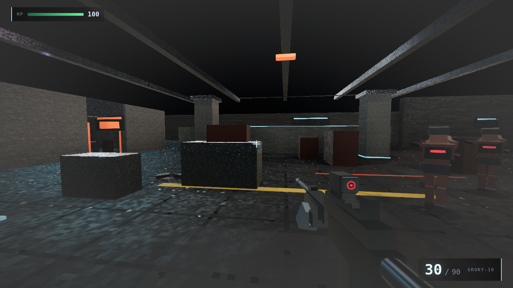
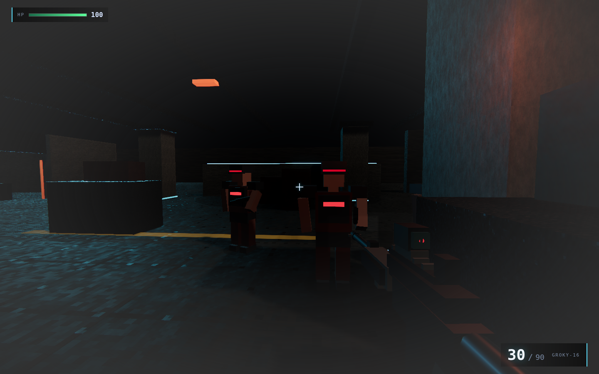
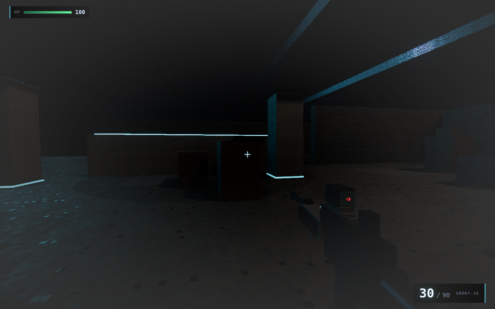
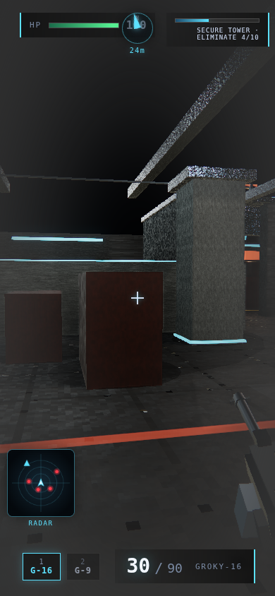

# Screenshot gallery

CryoCritic Artifact-Gate shots (SwiftShader captures on agent box). See also shots/README.md and RELEASE.md.

| Shot | File |
|------|------|
| Control tower interior | [01-mid-greybox.png](./shots/01-mid-greybox.png) |
| Combat mid-shot (SMG + hostiles) | [02-combat.png](./shots/02-combat.png) |
| HUD + compass / minimap | [03-hud-closeup.png](./shots/03-hud-closeup.png) |
| HUD mobile width | [04-hud-mobile.png](./shots/04-hud-mobile.png) |

Capture hooks: Vite preview + Chrome CDP (?capture=mid|combat|hud|tower), wait on window.__COG_READY__.
